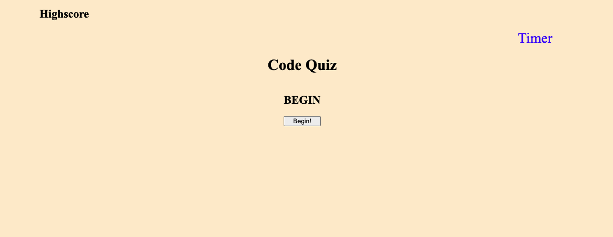
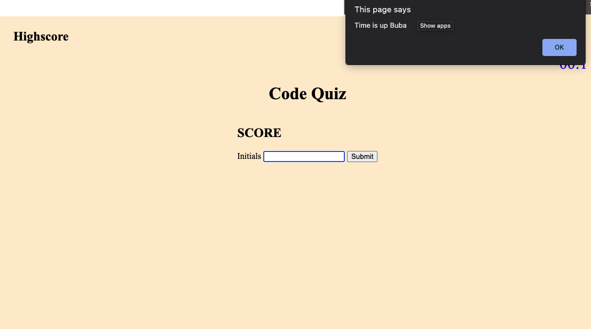

# Code-Quiz-Sssignment
by: Yonas Woldemichael
# 04 Web APIs: Code Quiz

## Table of Contents
- [Description](#description)
- [Installation](#installation)
- [Visuals](#visuals)
- [Usage](#usage)

## Description
In this assignment the student was tasked with creating a timed quiz on JavaScript Fundamentals that stores high scores so that they may be able to be compared with their fellow peers

This assignment was also a great way for me to gain some hands on skills in using javascript. Even though it is not perfect, I do hope to come back & gradually make it better

## Notes

1. The quiz contains 4 questions for the user to answer
2. The quiz will store your score
3. The quiz will also deduct time of of the coutdown for every incorrect answer
4. The quiz will ask you for your initals to save your score.

## Visuals
Here is a screenshot taken during the quiz

#
Here is a screenshot taken towards the end when the time has run out & your initials are asked

#

## Usage
The Coding quiz really has no other use other than allowing me to practice and implement my javascript knowledge

[Link to the deplyed site]()

[Repository]()

Thank You.
